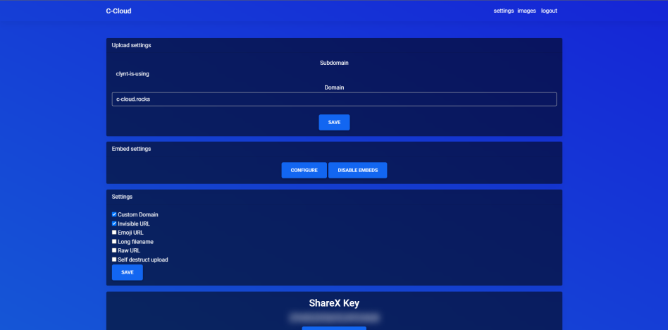

# Image Host

A Image host like upload.systems and the other gay uploader. Have fun skidding guys :)


## FAQ

#### Can i skid this?

Yes AsylantenCeo#1337, you can skid this :)

#### How simple is it to setup?

Very easy just edit the config and add database or just read the setup section.

#### How do i add other domains?
Well if you cant do this by yourself then think about if you really want to be a clown...


## Installation

Setup the image hoster easy

```bash
  1. Download repo
  2. Upload to your webhost
  3. Create database
  4. Go to domain.com/installer/
  5. Complete all steps
  6. Go to domain.com/
  7. Enjoy
```
    
## Features

Some features (not all)

- Light/dark mode toggle
- Invisible URL
- Emoji URL
- Exploding images
- Pastes
- Multi users support
- Invite only

## Hate
Dont hate it, ik its trash and yeah i know its working directly with sql :P


## Screenshots




## API Reference

#### Get all items

```http
  POST /api/upload
```

| Parameter | Type     | Description                |
| :-------- | :------- | :------------------------- |
| `sharex`  | `true`   | **Required**.              |
| `key`     | `string` | **Required**. Your API key |

#### Get item

```http
  GET /api/randomstring
```

| Parameter | Type     | Description                       |
| :-------- | :------- | :-------------------------------- |
| `length`      | `int` | **Required**. Length of the int |

```http
  GET /api/randomnumber
```

| Parameter | Type     | Description                       |
| :-------- | :------- | :-------------------------------- |
| `length`      | `int` | **Required**. Length of the string |

```http
  GET /api/domains/list
```

|  Description                       |
|  :-------------------------------- |
| List every domain available to use |

```http
  GET /api/stats
```

|  Description                       |
|  :-------------------------------- |
| Display stats |


## Support

For support, join our [discord](https://discord.gg/nRBkz2NWSU).


## Contributing

Contributions are always welcome!

See `contributing.md` for ways to get started.

Please adhere to this project's `code of conduct`.


## Authors

- [@Clynt](https://github.com/clynt707)


<!--  -->

